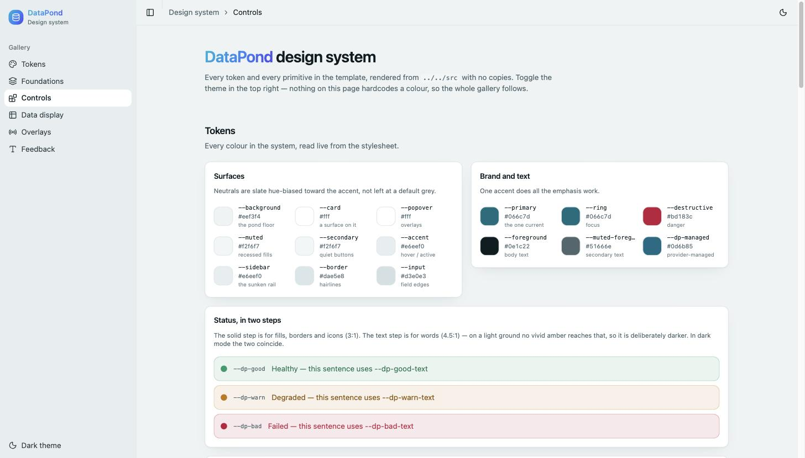
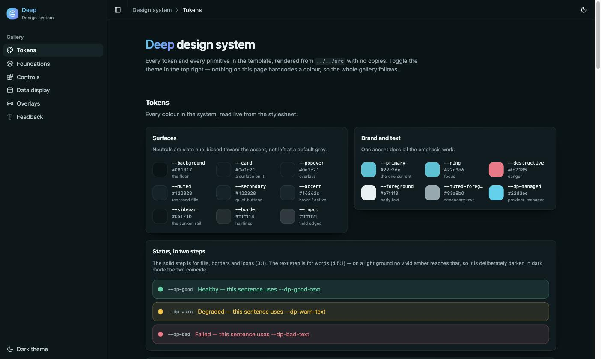
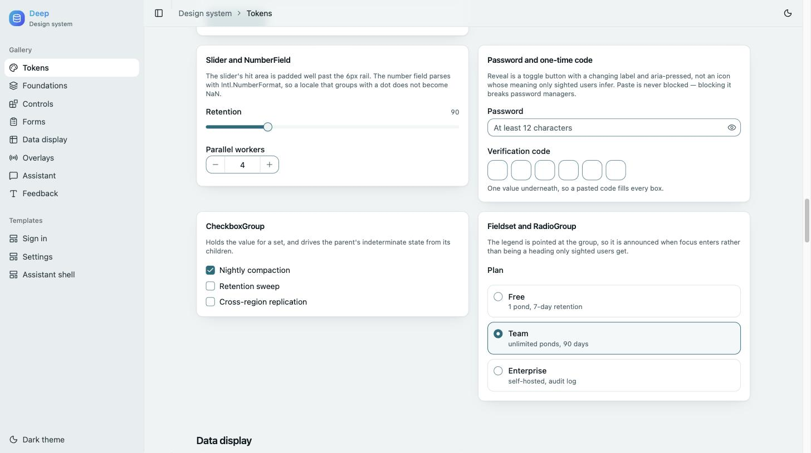
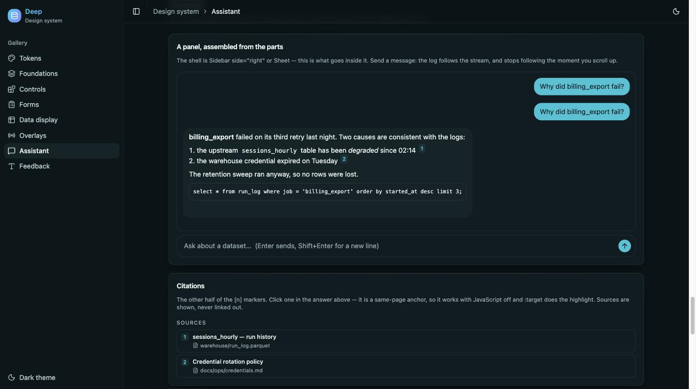

# Deep

**Layered depth, one aqua current.** Neutrals are slate hue-biased toward the aqua accent
rather than left at a default grey, elevation is carried by a two-stop shadow plus a faint
top hairline, and a single gradient does all the emphasis work.

Theme tokens plus 49 UI primitives, packaged as a **copy-in source template** you can drop
into any React app. MIT licensed — copy it, edit it, ship it.

Currently **v0.1.0**. Since you copy the source rather than install it, a version is not
something you can bump — it is a point you can name. Take a copy at a tag, and
[CHANGELOG.md](./CHANGELOG.md) tells you what to change in your own files to catch up.

There is no build step and nothing to `npm install` from a registry. You copy `src/` into
your project, install the peer dependencies, and own the code from then on. That is the
same model shadcn/ui uses, and it is deliberate: these components are meant to be edited.

Originally extracted from [DataPond](https://github.com/lukesgood/datapond) and since
taken further — see [Differences from DataPond's copy](#differences-from-dataponds-copy).
The `dp` in `--dp-*` and `.dp-*` is this system's name, not that one's.

**[See the gallery →](https://lukesgood.github.io/deep-ui/)**

| | |
|---|---|
|  |  |
|  |  |

The first two are the same page — the theme is one class on `<html>`.

---

## See it

The gallery renders every token and every primitive on one page:
**[lukesgood.github.io/deep-ui](https://lukesgood.github.io/deep-ui/)**.

It lives in `examples/demo` and imports the template through the `@/*` alias pointed at
`../../src`, so nothing is copied — what the page shows is the source in this repo, and it
cannot drift from it.

```bash
npm install     # workspace install, covers the template and the demo
npm run demo    # http://localhost:5173
```

---

## What's in here

```
src/
  styles/tokens.css       the whole theme: light/dark vars, @theme mapping, .dp-* utilities
  components/ui/*.tsx     49 primitives (shadcn "base-nova" style, built on @base-ui/react)
  lib/utils.ts            cn()
  lib/markdown.ts         the Markdown parser that components/ui/markdown.tsx renders
  lib/toast.tsx           ToastProvider + useToast()
  lib/confirm.tsx         ConfirmProvider + useConfirm()  (promise-based window.confirm)
  hooks/use-mobile.ts     useIsMobile()
  hooks/use-stick-to-bottom.ts   follows a streaming log, but only while invited
templates/                whole screens, also copy-in — see Templates below
examples/demo/            the gallery above — not part of what you copy
```

`src/` mirrors the directory layout the files expect to land in, so every internal import
(`@/components/ui/button`, `@/lib/utils`, `@/hooks/use-mobile`) resolves unchanged once
copied. Don't rearrange the folders unless you're prepared to rewrite those paths.

**No framework coupling.** Nothing here imports from Next.js. It runs the same under
Vite, React Router, Remix, or Next.

---

## Install

### 1. Dependencies

```bash
npm install @base-ui/react class-variance-authority clsx tailwind-merge \
            lucide-react tw-animate-css shadcn
npm install -D tailwindcss @tailwindcss/postcss
```

Requires **React 19** and **Tailwind CSS v4**. (`shadcn` is a runtime dependency here, not
just a CLI — `tokens.css` imports its stylesheet.)

### 2. Copy the source

```bash
cp -r deep-ui/src/components/ui   your-app/components/
cp -r deep-ui/src/lib/*           your-app/lib/
cp -r deep-ui/src/hooks/*         your-app/hooks/
cp    deep-ui/src/styles/tokens.css  your-app/app/
```

Adjust to taste — the only hard requirement is that your `@/*` alias points at whatever
root now contains `components/`, `lib/`, and `hooks/`.

### 3. Wire the alias

`tsconfig.json`:

```json
{ "compilerOptions": { "baseUrl": ".", "paths": { "@/*": ["./*"] } } }
```

### 4. Import the tokens

In your entry stylesheet, **after** Tailwind:

```css
@import "tailwindcss";
@import "./tokens.css";
```

### 5. Mount the providers

`Tooltip`, `Toast`, and `Confirm` each need a provider above them:

```tsx
import { TooltipProvider } from "@/components/ui/tooltip"
import { ToastProvider } from "@/lib/toast"
import { ConfirmProvider } from "@/lib/confirm"

<ToastProvider>
  <ConfirmProvider>
    <TooltipProvider>{children}</TooltipProvider>
  </ConfirmProvider>
</ToastProvider>
```

### 6. Dark mode

Driven by a `.dark` class on an ancestor (`@custom-variant dark (&:is(.dark *))`). Toggle
`document.documentElement.classList.toggle("dark")` — the template ships no theme switcher.

---

## Tokens

### Standard shadcn tokens

`--background` `--foreground` `--card` `--popover` `--primary` `--secondary` `--muted`
`--accent` `--destructive` `--border` `--input` `--ring` `--radius`, the `--sidebar-*`
family, and `--chart-1` … `--chart-5`. Use them through Tailwind utilities as usual:
`bg-background`, `text-muted-foreground`, `border-border`.

The accent is aqua — `#066c7d` light, `#22c3d6` dark. `--radius` is `0.7rem`, and the
`--radius-sm…4xl` scale is derived from it, so changing that one value rescales everything.

Type comes from Tailwind's scale plus one step: **`text-2xs`** (11px), because dense UI —
code blocks, citation markers, table furniture — kept reaching below Tailwind's 12px floor
and landing on arbitrary values instead.

The light accent is a deeper aqua than the chart ramp's `#0995ad`, and that is deliberate:
`--primary` carries white text on the filled button and is itself used as link text, so it
has to clear 4.5:1. A chart fill is non-text and only owes 3:1, so `--chart-1` stays a
touch brighter. See [Accessibility](#accessibility).

`--chart-1` … `--chart-5` are spaced at least 53 degrees apart in hue, in both themes.
Categorical series are told apart by hue, not lightness — an earlier ramp had two teals
three degrees apart, which is one series as far as a reader is concerned.

### Deep extras

These are **not** Tailwind theme colors — reach them with arbitrary-value syntax,
`text-[var(--dp-good-text)]` or `bg-[var(--dp-good)]/10`.

| Token | Purpose |
|---|---|
| `--dp-gradient` | the signature current — logo, active rails, key emphasis |
| `--dp-aqua` | the accent as a raw value |
| `--dp-good` / `--dp-warn` / `--dp-bad` | the status triad, **solid step** — fills, borders, icons |
| `--dp-good-text` / `--dp-warn-text` / `--dp-bad-text` | the status triad, **text step** — words |
| `--dp-managed` | provider-managed resources (vs. self-hosted) |
| `--dp-shadow` / `--dp-shadow-lg` | two-stop elevation |
| `--dp-hairline` | the faint top highlight on a raised surface |

**Why the status colors come in two steps.** A dot, a border or an icon is non-text
content, so WCAG asks 3:1 of it and the vivid value is the right one. A sentence needs
4.5:1, and on a light ground no vivid amber or emerald gets there — so the `-text` step is
deliberately darker. Reach for the solid step when you are painting a shape and the `-text`
step when you are writing a word. In the dark theme the solid step already clears 4.5:1, so
the two are the same value and the distinction costs you nothing.

```tsx
<span className="size-2 rounded-full bg-[var(--dp-warn)]" />
<span className="text-[var(--dp-warn-text)]">Degraded</span>
```

### Utility classes

| Class | Effect |
|---|---|
| `.dp-gradient` | the gradient as a background |
| `.dp-gradient-text` | the gradient clipped to text |
| `.dp-surface` | elevation shadow + top hairline — already applied by `<Card>` |
| `.dp-elevated` | the heavier shadow, for modals and popovers |
| `.dp-num` | `font-variant-numeric: tabular-nums`, for figures in tables |

A `shake` keyframe is also defined, for invalid-input feedback:
`className={invalid ? "[animation:shake_0.5s_ease-in-out]" : ""}`.

### Layers

Stacking order is a scale like any other. Every overlay used to sit at `z-50`, which meant
the order they stacked in was whatever order they reached the DOM — the visible symptom
being a toast raised from inside a dialog going *behind* it, hiding the confirmation of
the thing you just did.

Tailwind v4 has no z-index theme namespace, so reach these with arbitrary-value syntax:
`z-[var(--dp-z-modal)]`.

| Token | | |
|---|---|---|
| `--dp-z-raised` | 10 | fixed page chrome — the app sidebar |
| `--dp-z-sticky` | 30 | sticky headers, and the sidebar's drag rail |
| `--dp-z-backdrop` | 40 | the dim behind a modal |
| `--dp-z-modal` | 50 | dialog, alert dialog, sheet |
| `--dp-z-popover` | 60 | dropdown, select — must open above a modal |
| `--dp-z-tooltip` | 70 | sits above whatever it describes, anywhere |
| `--dp-z-toast` | 80 | confirms what you just did; nothing covers it |

The ladder is deliberately sparse. If you need a step between two of these, what you
probably want is a local stacking context, not a new rung.

### Motion

There is no motion token scale, on purpose — Tailwind's own is enough, and a parallel set
of names would be ceremony. The convention: `duration-100` for a state change,
`duration-150` by default, `duration-200` for something entering or leaving the page.

What the system does add is the part Tailwind leaves to you. A reader who has asked their
OS for less movement gets it, across all three sources of motion at once — Tailwind's
transition utilities, `tw-animate-css`'s enter/exit animations, and the `shake` keyframe:

```css
@media (prefers-reduced-motion: reduce) { /* in tokens.css */ }
```

### Fonts

Set `--dp-font-sans`, `--dp-font-mono`, or `--dp-font-heading` to override; each falls back
to a system stack, so the template looks right before you wire up any webfont.

```tsx
// Next.js example
const inter = Inter({ subsets: ["latin"], variable: "--font-inter" })
<html className={inter.variable} style={{ "--dp-font-sans": "var(--font-inter)" }}>
```

---

## Components

`accordion` · `alert` · `alert-dialog` · `avatar` · `badge` · `breadcrumb` · `button` ·
`card` · `checkbox` · `checkbox-group` · `citations` · `collapsible` · `combobox` ·
`composer` · `context-menu` · `conversation` · `dialog` · `dropdown-menu` · `error-box`
· `field` · `input` · `label` · `markdown` · `menubar` · `meter` · `navigation-menu` ·
`number-field` · `otp-field` · `pagination` · `password-input` · `popover` ·
`preview-card` · `progress` · `radio-group` · `scroll-area` · `select` · `separator` ·
`sheet` · `sidebar` · `skeleton` · `slider` · `switch` · `table` · `tabs` · `textarea` ·
`toggle` · `toggle-group` · `toolbar` · `tooltip`

### Authentication

There is no login *page* — that is a template, not a primitive, and it is three of these
composed. What the set does provide is the two controls people get wrong:

- **`password-input`** — a password box with a reveal toggle. The toggle is a
  `type="button"` so it does not submit the form, its label changes with the state and
  `aria-pressed` reports it, and `aria-controls` ties it to the input. Paste is never
  blocked: blocking it breaks password managers and pushes people towards passwords they
  can remember. Pass `autoComplete="new-password"` on sign-up and reset forms, or the
  manager offers the old one.
- **`otp-field`** — the 2FA code. One value underneath several boxes, so a pasted code
  fills all of them, Backspace walks backwards, and SMS autofill reaches it. A row of
  `<input maxlength="1">` gets none of that.

Everything else a sign-in screen needs is already here: `Field` for the label/error
wiring, `Input`, `Button`, `Checkbox` for "remember me", `Card` for the shell.

### Translating what the components say

Every word a component says on its own — `"Dismiss notification"`, `"Toggle Sidebar"`,
`"Go to the previous page"` — comes from `lib/strings.tsx` rather than the component
file. Most of them are `aria-label`s, which is the reason it matters: an untranslated
visible label is obvious the first time anyone looks at the screen, and an untranslated
`aria-label` is invisible to everyone except the person relying on it.

```tsx
import { StringsProvider } from "@/lib/strings"

const ko = {
  "toast.dismiss": "알림 닫기",
  "sidebar.toggle": "사이드바 열고 닫기",
  "pagination.previous": "이전",
}

<StringsProvider strings={ko}>{children}</StringsProvider>
```

Nothing is required, and nothing is all-or-nothing. A component takes its own prop if
you passed one, the provider's value if there is one, and English otherwise — so a
partial dictionary leaves the rest in English rather than blanking it, and an app that
never renders the provider behaves exactly as it did before this existed.

Keys are flat (`"toast.dismiss"`, not `{ toast: { dismiss } }`) so overriding one string
is `{ ...defaults, ...yours }` rather than a deep merge, which is a thing to get wrong.
`npm run check:tokens` fails on a new literal `aria-label` in `src/`, so the next
component cannot quietly reintroduce one.

`templates/` is exempt: a template is example code, and its words are meant to be
rewritten rather than translated.

### Script and direction

Two things the components do so an app does not have to remember to:

**Line breaking follows the language, when the page declares one.** Korean breaks
between 어절, not between arbitrary characters — without `word-break: keep-all` a
Korean sentence wraps mid-word, which reads as a typo rather than a line break.
Japanese and Chinese get the strict rules for small kana and punctuation. Both are
scoped by `:lang()`, so nothing reaches a language that does not want it, and both
depend on your page setting `lang` — which it should anyway.

The font stack ends in CJK faces for the same reason: `system-ui` resolves to Segoe UI
on Windows, which has no Hangul or kana at all.

**Dates are the browser's to format.** `templates/profile.tsx` uses
`Intl.DateTimeFormat` and `Intl.RelativeTimeFormat` rather than strings: "12 Mar 2026"
is wrong in most of the world before anyone translates a word, and "3 days ago" is not
"3일 전" with the words swapped. Each renders inside a `<time datetime>` so the instant
survives the formatting.

**Text the components did not write carries `dir="auto"`.** `Markdown` (per block, so
one answer can hold an English paragraph and an Arabic one), `ConversationMessage`,
`ErrorBox`'s message, and a `Citation`'s title and location. All four render content
from somewhere else — a model, a server, an ingested document — and the browser can
work out the direction from the first strong character where a hardcoded `dir` cannot.

Labels use `leading-tight` rather than `leading-none`: a line-height of exactly 1 leaves
no room for the marks Thai, Vietnamese and Devanagari put above and below the line, and
clips them.

**RTL lays out.** Padding, margins, borders and text alignment use logical properties
(`ps-`, `border-s`, `text-start`), and trailing-edge affordances — a select's tick, a
dialog's close, a sidebar's action — sit at `end-*` rather than `right-*`. What stays
physical stays physical on purpose: `left-1/2` paired with `-translate-x-1/2` is
centring, not direction, and `Sheet`'s and `Sidebar`'s `side="left" | "right"` mean what
they say.

For anything that *slides*, CSS has no logical transform, so `--dp-flip` carries the
sign: `translate-x-[calc(8px*var(--dp-flip))]` moves toward the end of the line in
whichever direction the line runs.

One known gap: `Switch`'s thumb still travels rightward in both directions, so it
overshoots its track under `dir="rtl"`. Both a `ltr:`/`rtl:` pair and `--dp-flip` were
tried — `--tw-translate-x` computes to the negative value and the element lays out as
though it were positive — and it was left alone rather than shipped half-fixed.

### Assistant panels

`markdown.tsx` was always half of an assistant panel — it renders the subset a model
emits, and `citations` turns `[1]` into a marker. `conversation`, `composer` and
`citations` are the other half. There is no panel *shell*: dock it with
`<Sidebar side="right">` or float it with `<Sheet>`, both of which already exist.

```tsx
<Conversation label="Assistant conversation">
  {turns.map((t) => (
    <ConversationMessage key={t.id} from={t.from}>
      {t.from === "assistant"
        ? <Markdown text={t.text} citations citationHref={(n) => `#citation-${n}`} />
        : t.text}
    </ConversationMessage>
  ))}
  {busy && <ConversationPending />}
</Conversation>

<Composer busy={busy} onSend={send}>
  <ComposerInput value={draft} onChange={…} aria-label="Message" />
  <ComposerSubmit onStop={stop} />
</Composer>
```

Three decisions in there worth knowing:

- **The log follows the stream only while you left it at the bottom.** Scroll up to
  re-read something and it stops following; a jump-to-latest button appears instead.
  Yanking someone back down on every token is worse than not following at all.
- **Enter sends, Shift+Enter breaks the line — except mid-composition.** In Korean,
  Japanese and Chinese input the first Enter commits the IME candidate, so binding it
  unconditionally truncates the sentence mid-word.
- **Citations are shown, never linked out.** `citationHref` builds a *same-page* anchor
  to the matching `<Citation>`, so it works with JavaScript off and `:target` does the
  highlight. The prose and any URLs in it come from ingested documents, which is the same
  reason `lib/markdown.ts` refuses to build anchors at all.

Two more are worth calling out:

- **`sidebar.tsx`** (723 lines) is the largest piece — a full collapsible app shell with
  rail, mobile sheet fallback, keyboard shortcut, and cookie-persisted state. It depends on
  `button`, `input`, `separator`, `sheet`, `skeleton`, `tooltip`, and `useIsMobile`.
- **`markdown.tsx`** renders the Markdown subset an LLM actually emits. Parsing lives in
  `lib/markdown.ts` so it can be tested alone, and it never interprets HTML — the parser
  emits a closed set of node types, so there is no path from model output to markup.

`error-box.tsx` provides `<ErrorBox>` and `<EmptyState>`, the two surfaces that otherwise
get reinvented ad hoc on every page.

---

## Templates

`src/` gives you parts; `templates/` gives you three whole screens to start from. They
are copy-in the same way, and they import the primitives through the same `@/*` alias, so
what you see in the gallery is what you get from the file.

| | |
|---|---|
| [`sign-in`](templates/sign-in.tsx) | Passkey, password and a sign-in link, with a second factor — one card, five steps |
| [`profile`](templates/profile.tsx) | Identity, passkeys, active sessions, and the end of the road |
| [`settings`](templates/settings.tsx) | Tabs, grouped fields, and a save bar that appears only once something changed |
| [`assistant-shell`](templates/assistant-shell.tsx) | An app shell with the assistant docked on the right |

Each is a starting point, not a component — copy it and change everything. What is worth
keeping is the wiring, which is invisible when right and expensive when wrong. Two things
they demonstrate that are easy to get backwards:

**Show people their passkeys and their sessions.** `profile` lists both, because they
are what someone came to the account screen to change after losing a laptop, and most
products bury them. The two details that make those lists usable: the current session says
so — "end anything you do not recognise" is a guess otherwise — and removing your *last*
passkey warns differently from removing a spare.

**Passkeys need one thing from the markup.** `autoComplete="username webauthn"` on the
email field is what lets the browser offer a saved passkey from the field itself; without
that token, a `mediation: "conditional"` request shows nothing at all. The button beside
it covers the usernameless case.

**A step change has to move focus.** `sign-in` swaps one card between five states. Doing
that without moving focus leaves a keyboard or screen-reader user standing on a button
that no longer exists, hearing nothing — so each step takes focus on its own heading.

**Let the browser validate, and supply only the wording.** `type="email" required` already
knows what a malformed address is. A custom `validate` alongside it looks like it works
and does not — native validation fails first, so the custom one never runs and the reader
gets the browser's *"Constraints not satisfied"*. One `<FieldError match="...">` per case
is the fix.

**A responsive panel has to branch in JavaScript, not CSS.** `assistant-shell` picks
between a docked `<aside>` and a `<Sheet>` with `useIsMobile()`. Hiding the Sheet with
`lg:hidden` instead leaves it *open* on desktop, so its backdrop dims and blurs the whole
page behind a panel nobody can see.

If you copy `templates/`, make sure your Tailwind setup scans it — a class used only in
there is otherwise tree-shaken and the screen renders unstyled.

---

## Accessibility

**What the palette guarantees.** Every foreground/background pair the tokens can produce
was measured, in both themes, against all four surfaces (`--card`, `--background`,
`--muted`, `--sidebar`) and against each colour's own 10% tint — the combination a tinted
button or an inline error actually renders:

- text tokens clear **4.5:1** (WCAG 2.1 AA, normal text)
- the solid status step, the chart ramp and the focus ring clear **3:1** (AA non-text)

That is 232 pairs, and they all pass. Several light-theme values are darker than a stock
shadcn palette for exactly this reason.

This is not a claim you have to take on trust, and it is not a claim that rots:

```bash
npm run check:contrast                # summary
npm run check:contrast -- --verbose   # every pair, with its ratio
```

The checker reads the real values out of `tokens.css`, and it **fails on any token it
cannot parse** rather than skipping it — a checker that quietly ignores what it does not
understand reports green for the wrong reason. CI runs it on every push.

`--input` is in that set: a field's edge is the only thing that says where the field is,
so WCAG 1.4.11 covers it and it clears 3:1. `--border` is not, and is deliberately left
soft — it draws structure between sections rather than identifying a control, which is
outside what 1.4.11 asks for.

**What it does not guarantee.** The components are keyboard-operable and labelled, toasts
announce (errors as `role="alert"`, the rest as `role="status"`), and
`prefers-reduced-motion` is honoured, but **none of this has been through a screen-reader
audit.** Treat the components as a good starting point, not a compliance claim.

### What an audit still has to cover

A script can measure contrast and a test can assert that an attribute is present. Neither
tells you what a screen reader actually *says* — whether an announcement arrives once or
forty times, whether focus lands somewhere sensible, whether the order things are read in
matches the order they appear.

**Four findings did not need one, and are fixed.** They were visible in the source, which
is worth saying: the parts of an audit a script can reach should be done before anyone
spends an afternoon with a screen reader on them.

| | |
|---|---|
| Tooltip content was never announced | The trigger got no `aria-describedby`, and the popup had neither an `id` nor `role="tooltip"`. Now wired, and only while open — a description pointing at an unmounted element is its own small lie. |
| Markdown headings were not headings | `#` rendered as a styled `<p>`. Now real `<h3>`–`<h6>`, starting at `baseHeadingLevel` (default 3) because a model's `#` is a heading *inside* the answer, not the page's `<h1>`. |
| Skeleton was exposed as empty content | Now `aria-hidden`. Say the wait is happening with `aria-busy` on the region the skeletons stand in for. |
| Table headers carried no `scope` | `TableHead` now defaults to `scope="col"`; pass `scope="row"` on headers that label a row. |

One thing checked while fixing those, because it would have made the tooltip gap severe:
a sidebar collapsed to icons keeps its buttons' names. The label is clipped by `overflow`,
not removed from the accessibility tree.

**Needs a person with a screen reader.** Ordered by how badly it goes wrong when it is
wrong:

- **Live regions.** Does a streaming answer in `Conversation` announce once when it
  settles, or on every token? Does a `Toast` interrupt appropriately — errors as `alert`,
  the rest as `status` — and does a burst of three announce as three? Does
  `ConversationPending` say anything useful?
- **Focus.** Dialog, AlertDialog and Sheet: is focus trapped, and does it return to the
  trigger on close? Does the sidebar's mobile Sheet return focus to the trigger? Does
  Combobox keep focus in the input while `aria-activedescendant` moves?
- **Naming.** Every icon-only control: `SidebarTrigger`, `ComposerSubmit`,
  `ConversationActions`, the toast dismiss, the pagination arrows. Does `OtpField`
  announce which box you are in?
- **State.** Accordion and Collapsible expanded/collapsed; Toggle and ToggleGroup pressed;
  the sidebar's own collapsed state; which Tab is selected and whether the panel is
  announced on switch.
- **Forms.** Does a `Field` error reach the reader on submit, and is the description read
  before it? Is a `Fieldset` legend announced when focus enters the group? Does
  `PasswordInput`'s toggle read its pressed state?
- **Reading order.** In `templates/assistant-shell`, does the docked panel come after the
  main content or interrupt it? Does the citation list read in a sensible place relative
  to the answer that cites it?

**Coverage that would count as done.** NVDA and JAWS on Windows (Chrome and Firefox),
VoiceOver on macOS (Safari) and iOS, TalkBack on Android. A finding on one is a finding;
agreement across all four is not required to act.

Findings are welcome as issues — including "this is fine, I checked", which is worth
recording so nobody checks it twice.

The excluded tokens are listed in `scripts/check-contrast.mjs` with a reason each, so the
exclusions are as reviewable as the assertions.

---

## Differences from DataPond's copy

This started as a snapshot of [DataPond](https://github.com/lukesgood/datapond)'s own
components and is no longer one. DataPond is Apache-2.0 and remains its own project; this
is MIT and stands alone. What changed:

1. **`ErrorBox` was decoupled.** DataPond's version hardcoded an "no embedding or LLM model
   is configured" hint and a `next/link` to `/settings`. That is now an optional `hint`
   prop taking any node, which removed the template's only Next.js import. It also now
   renders in `--dp-bad` rather than `--dp-warn` — it is an error box, and it was amber.
2. **`--dp-bad` was added.** DataPond referenced `var(--dp-bad)` on its Services page but
   never defined it, so that icon rendered uncolored. Defined here in both themes.
3. **The font tokens were made non-cyclic.** The original declared
   `--font-sans: var(--font-sans)` inside `@theme inline`, which is self-referential and
   only worked by cascade accident. Source variables are now distinctly named
   (`--dp-font-*`) and carry real fallback stacks.
4. **The light palette was retuned for AA**, and the status colours split into a solid and
   a text step. See [Accessibility](#accessibility).
5. **`Skeleton` was tokenized.** It was filled with a hardcoded `bg-slate-800/50`, which is
   invisible-to-wrong in the light theme. It now uses `bg-foreground/10`, which reads
   against any surface in either theme.
6. **`Toast` was tokenized and given a11y.** It painted itself with `green-500` /
   `red-500` / `blue-500` while the status tokens sat unused, announced nothing, had an
   unlabelled close button, and leaked its timers on unmount.
7. **`Card` was moved onto the `data-slot` convention.** It was the one file still on the
   older `React.forwardRef` shadcn generation, which meant `has-data-[slot=…]` selectors
   silently missed it.

`tokens.css` also drops `@import "tailwindcss"` — your app owns that import.

---

## Verifying a change

The template itself is never built or published; `package.json` and `tsconfig.json` are
here so it can be type-checked and tested standalone. The demo is a real Vite app and does
build.

```bash
npm install
npm run check        # everything below, which is exactly what CI runs
```

```bash
npm run typecheck       # the template and the tests
npm test                # 147 tests — every component mounts, plus the behaviour above
npm run check:tokens    # no literal colours, no raw z-index, no untranslatable labels
npm run check:contrast  # the palette, measured against tokens.css
npm run check:docs      # the numbers in this file, against the code they describe
npm run demo:build      # builds examples/demo — catches what typecheck can't
```

CI runs the same steps on Node 20, 22 and 24, and deploys the gallery to Pages on every
push to `main`.

Every component is mounted once by `test/smoke.test.tsx`, overlays in their open state,
and the case list is checked against the directory so a new component cannot arrive
without one. That is the cheap half. The rest is aimed at the failures this repo has
actually had rather than at coverage: that every overlay opens without taking the page down with it, that a `Field`
really does associate its label, hint and error with the control, that the composer does
not send mid-IME-composition. See [CONTRIBUTING.md](./CONTRIBUTING.md) for what is
enforced, and [CHANGELOG.md](./CHANGELOG.md) — which, for a copy-in template, is the only
upgrade path there is.

---

## Credits

The primitives here started as [shadcn/ui](https://ui.shadcn.com) output in its
`base-nova` style and were modified — retokenized, and in a few cases rewritten. Credit
for the component structure belongs upstream; the bugs are ours.

| | |
|---|---|
| [shadcn/ui](https://github.com/shadcn-ui/ui) | MIT — the component structure these derive from |
| [Base UI](https://base-ui.com) | MIT — the unstyled primitives every component is built on |
| [Lucide](https://lucide.dev) | ISC — icons (itself a fork of [Feather](https://feathericons.com), MIT) |
| [class-variance-authority](https://cva.style) | Apache-2.0 — the variant API |
| [Tailwind CSS](https://tailwindcss.com) | MIT — required, v4 |
| [tw-animate-css](https://github.com/Wombosvideo/tw-animate-css) | MIT — the enter/exit animations |

Those are npm dependencies you install yourself, not code vendored into `src/`, so their
licenses attach to your `node_modules` rather than to this template.

---

## License

[MIT](./LICENSE) — Copyright (c) 2026 Luke.

You are copying source into your own project, so the practical reading is: keep the
copyright notice somewhere (a `NOTICES` file, a header, your third-party page), and
otherwise do what you like. No attribution in your UI is required.

The `--dp-*` tokens and `.dp-*` classes carry the system's name, but they are prefixes,
not an API — rename them in your copy if you would rather they said something else.
